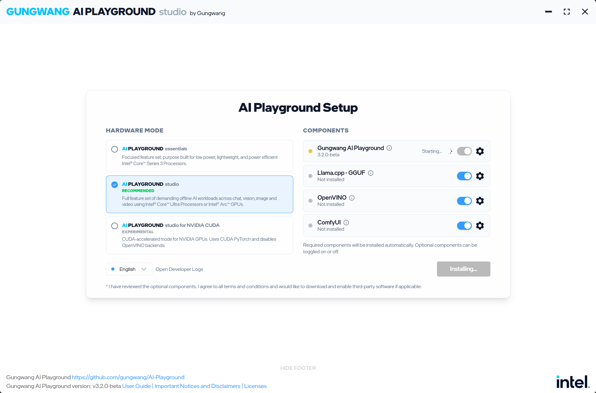
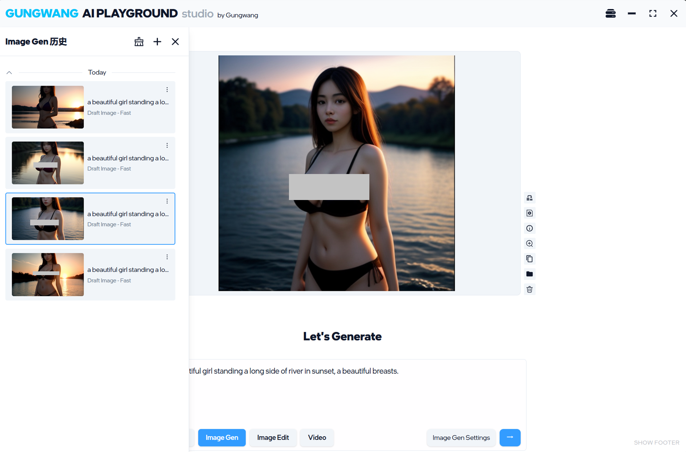

# 古武 AI 游乐场（Gungwang AI Playground）

下载 Windows 11 可执行安装文件： 
https://github.com/gungwang/AI-Playground/releases/download/v3.2.4/Gungwang.AI.Playground-3.2.4.exe

欢迎来到**古武 AI 游乐场** - 基于英特尔 AI Playground 的定制化、无限制本地 AI 生成套件。这是您的云端工具离线替代方案，**无内容限制**，完美适合创意专业人士和 AI 爱好者。



## 🎯 古武版有什么不同？

### 主要定制功能（v3.2.4）

✅ **NSFW 内容无限制** - 无安全过滤，生成任何内容  
✅ **无需上传** - 100% 本地运行  
✅ **零云依赖** - 完全离线运行  
✅ **开源代码** - 完全可自定义  
✅ **完全免费** - 无订阅、无数据收集  

### 我们所做的改变

1. **禁用 NSFW 安全过滤**
   - 移除 SafetyChecker 阻止
   - 后端现在接受所有生成的图像
   - 前端不再显示"NSFW 结果被阻止"覆盖
   - **修改文件：** `comfyui-deps/custom_nodes/SafetyChecker/nodes.py`, `WebUI/src/views/WorkflowResult.vue`

2. **版本更新至 3.2.4**
   - 从 3.2.0-beta 升级
   - 更新 Package.json、Package-lock.json、readme.md
   - 下载链接指向 v3.2.4 版本

3. **新增 Wan 2.2 三模式视频支持**
   - 添加新的 `Wan2.2` 视频预设
   - 支持 `Image2Video`、`Text2Video`、`Start2End` 三种模式
   - 保留轻量级 `TI2V-5B` 作为默认图生视频路径，并移除失效的 `Wan-AI 14B` 变体
   - 将 `Wan2.2` 纳入高显存视频预设提示范围

4. **增强文档**
   - 添加本地服务 URL 参考
   - 本地 API 端点已记录
   - 调试端口已配置：`29222`

---

## 🚀 功能特性

### 💬 高级聊天
- **模型:** Gemma4、Qwen3.5、Qwen3 VL、Mistral 7B、DeepSeek R1、GPT-OSS 20B
- **视觉:** 实时图像分析
- **推理:** 链式思维复杂问题求解
- **RAG:** 基于文档的知识检索

### 🎨 图像生成与编辑
- **模型:** Stable Diffusion 1.5、SDXL、Flux.1、Z-Image、Wan2.1 VACE、Wan2.2、LTX-Video
- **功能:** 放大、内绘、外绘、2D→3D 转换
- **无限制:** 生成任何风格和内容

### 📊 文档智能
- PDF/文本分析
- 多文档对比
- 知识提取

---

## 📋 系统要求

| 组件 | 要求 |
|------|------|
| **操作系统** | Windows 10/11 |
| **处理器** | 英特尔 Core Ultra（系列 1H、2V、2H、3） |
| **显卡** | 英特尔 Arc GPU 系列 A/B（8GB+ 显存） |
| **内存** | 建议 16GB+ |
| **存储** | 50GB+ 用于模型 |

---

## 🔧 本地 API 端点

运行时，以下服务在本地可用：

| 服务 | 地址 | 端口 | 用途 |
|------|------|------|------|
| **LLM 聊天** | `http://localhost:59000` | 59000 | 聊天和文本推理 |
| **图像生成** | `http://localhost:49350` | 49350 | 图像生成（ComfyUI） |
| **辅助推理** | `http://localhost:49351` | 49351 | 替代后端 |

### 健康检查

```bash
# 检查服务是否运行
curl http://localhost:59000/healthy
curl http://localhost:49350/healthy
```

---

## 📸 演示：无限制生成

查看无限制生成的力量：



*无安全过滤生成 - 完全创意自由*

---

## 💻 快速开始

### 1. 安装
下载和安装：[古武 AI Playground v3.2.4 安装程序](https://github.com/gungwang/AI-Playground/releases)

### 2. 首次运行
- 应用将引导您完成后端组件设置
- 需要网络下载初始模型
- 首次启动设置需要 5-15 分钟

### 3. 开始创建
- 打开 AI 游乐场
- 选择您的模型（聊天、图像、视频）
- **无限制**生成

---

## 🛠️ 安装故障排除

#### 1. Llama.cpp 嵌入问题
- 最新驱动程序有时需要使用 DDU 清理驱动程序缓存
- 防病毒软件可能阻止嵌入缓存的读写，可尝试临时关闭防病毒软件并重启系统

#### 2. 重启应用
- 某些超时问题会显示为安装失败，但重新启动 AI Playground 后通常可恢复正常

#### 3. 验证英特尔 Arc GPU
- 打开“设备管理器”，在“显示适配器”下确认设备名称
- 如果显示 `Intel(R) Graphics`，则通常不满足独立 Arc GPU 的最低要求
- 如果系统同时存在独显和集显，可尝试暂时禁用集显进行排查

#### 4. 安装中断
- 后端组件在线安装可能被 IT 网络、防火墙或睡眠设置中断
- 建议在开放网络环境下操作，并保持设备通电唤醒

#### 5. 缺少库文件
- 部分 Windows 系统可能缺少必要运行库
- 可从微软官网安装 64 位 VC++ 再发行版后重试安装

#### 6. Python 冲突
- 已有 Python 环境可能与 AI Playground 安装冲突
- 常见处理方式是卸载冲突环境、重启系统后重新安装 AI Playground

#### 7. 临时文件残留
- 安装失败后可能残留临时文件
- 删除这些文件或执行全新安装通常可以解决问题

---

## 🛠️ 开发设置

### 用于调试和开发

```bash
cd WebUI
npm install
npm run dev
```

这启用：
- 热模块重加载（更改自动应用）
- Chrome 开发者工具调试（Ctrl+Shift+I）
- TypeScript 完整源映射

### 后端服务

Python 后端会随 `npm run dev` 自动启动：
- **端口 59000**：LLM 推理服务
- **端口 49350**：ComfyUI 图像生成
- **端口 49351**：辅助推理引擎

---

## 🤖 模型支持

AI Playground 不会预装全部生成式 AI 模型。模型可以通过应用界面直接配置，也可以由用户从 HuggingFace 或 CivitAI 下载后放入相应模型目录中。

**当前应用链接的模型信息请参考模型注册表。**

> 在生产环境中使用模型前，请务必检查对应许可证条款。

### 使用其他模型

- 查看[用户指南](https://github.com/intel/AI-Playground/blob/main/AI%20Playground%20Users%20Guide.pdf)了解详情
- 或参考[此视频](https://www.youtube.com/watch?v=1FXrk9Xcx2g)学习如何向 AI Playground 添加额外的 Stable Diffusion 模型

---

## 📝 更新日志 - 古武版

### v3.2.4
- ✅ 完全禁用 NSFW 安全过滤
- ✅ 移除"NSFW 结果被阻止"覆盖
- ✅ 从 3.2.0-beta 版本升级
- ✅ 添加本地 API 文档
- ✅ 增强中文 README（README_GUNGWANG.zh.md）

### v3.2.0（基于英特尔版本）
- 基础：英特尔 AI 游乐场
- 多个 LLM 后端（GGUF、OpenVINO）
- 图像生成（Stable Diffusion、SDXL、Flux）
- 视觉能力（Qwen VL）
- 视频生成（LTX-Video）

---

## 🔒 隐私与安全

- **100% 本地** - 数据不会离开您的电脑
- **离线优先** - 初始设置后完全离线工作
- **无云调用** - 所有推理都在您的硬件上进行
- **开源** - 完全代码透明
- **您的数据** - 完全隐私保证

---

## 🛠️ 技术栈

| 组件 | 技术 |
|------|------|
| **前端** | Vue 3、TypeScript、Tailwind CSS |
| **桌面应用** | Electron |
| **LLM 引擎** | Llama.cpp、OpenVINO、GGUF |
| **图像生成** | ComfyUI、PyTorch、Diffusers |
| **后端** | Python、Flask/FastAPI |

---

## 📚 资源

- **[用户指南](https://github.com/intel/AI-Playground/blob/main/AI%20Playground%20Users%20Guide.pdf)** - 完整文档
- **[原始英特尔仓库](https://github.com/intel/AI-Playground)** - 基础项目
- **[模型注册表](https://huggingface.co/)** - 可用模型
- **[古武分支](https://github.com/gungwang/AI-Playground/tree/dev.2)** - 此定制版本

---

## 🤝 贡献

发现问题或有改进建议？
- Fork 仓库
- 创建功能分支
- 提交拉取请求

---

## ⚖️ 许可证

本项目保持与英特尔 AI 游乐场相同的许可证。详见 [LICENSE](./LICENSE)。

模型许可证各不相同 - 在生产环境中使用前请务必检查。

---

## 💡 提示与技巧

### 最佳性能：
1. 使用 **SDXL 或 Flux** 获得高质量图像
2. 使用 **Qwen3.5** 平衡聊天性能
3. 启用**推理模型**（DeepSeek R1）处理复杂查询
4. 先生成 **512x512** 分辨率，然后放大

### 用于视频生成：
1. 使用 **LTX-Video** 或 **Wan2.2 TI2V-5B** 作为起点
2. 保持提示词描述性但简洁
3. 视频生成较慢 - 请耐心等待

### 常见问题：
- **首次运行缓慢：** 模型正在下载，这是正常的（10-30 分钟）
- **GPU 未检测到：** 更新英特尔 Arc 驱动程序
- **内存错误：** 降低图像分辨率或使用较低级别的模型

---

**由古武用 ❤️ 开发**  
*无限制。本地运行。完全免费。*

---

**最后更新：** 2026 年 4 月 20 日  
**版本：** 3.2.4  
**状态：** 稳定

---

## 更新 - 2026 年 4 月 20 日

### 今日变更

- 将 `Wan2.2` 简化回单一的 TI2V-5B 图生视频预设
- 删除 `Text2Video` 与 `Start2End` 的 14B 路径，因为它们会触发大体积 Wan 2.2 14B 模型下载，不符合当前应用的目标用法
- 保留 `Wan2.2` 的视频显存提示逻辑
- 同步更新源码预设与已构建应用内的预设副本，使当前打包好的应用也不再请求 Wan 2.2 14B 模型

### 变更总结

- Wan 2.2 现在在应用中只保留 TI2V-5B 图生视频工作流
- 该预设不再请求 Wan 2.2 14B 的文生视频或首尾帧视频模型
- 目前仍会保留 TI2V-5B 运行所需的共享文本编码器与 VAE 依赖下载

### 已实施解决方案

- 直接从 `Wan2.2` 预设中移除全部 14B 变体，而不是在下载弹窗阶段做额外绕过
- 保留稳定的 TI2V-5B ComfyUI 工作流，这更符合 Intel Arc A770 16GB 的实际使用场景
- 将相同修复同步到 `build/electron/win-unpacked` 中的预设副本，确保当前已构建应用与源码行为一致

### 当前验证状态

- 预设 JSON 与说明文档已同步更新
- `Wan2.2` 预设文件中已不再包含 14B 模型引用

Check Port:
cd /c/AI/intel-ai/AI-Playground/LlamaCPP/llama-cpp (dev.5)

netstat -ano | findstr LISTENING

$ ./llama-server
load_backend: loaded RPC backend from 

Git Bash version (slashes instead of backslashes):
./llama-server \
  --model "/c/AI/AI Playground/Gungwang AI Playground/resources/models/LLM/ggufLLM/unsloth---Qwen3.6-35B-A3B-GGUF/Qwen3.6-35B-A3B-UD-IQ3_S.gguf" \
  --port 8080 \
  --ctx-size 8192 \
  --threads 8 \
  --gpu-layers 50

http://127.0.0.1:8080