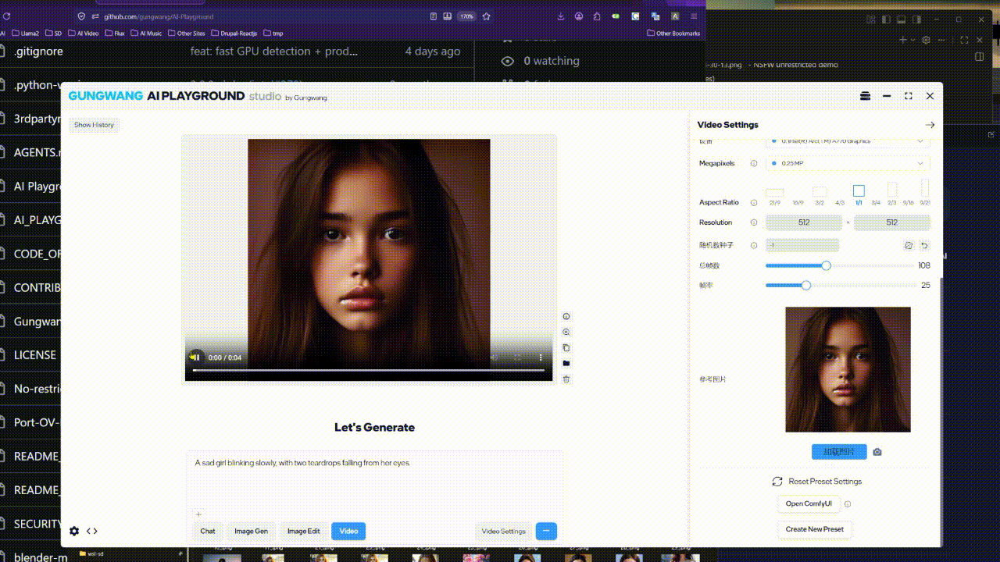
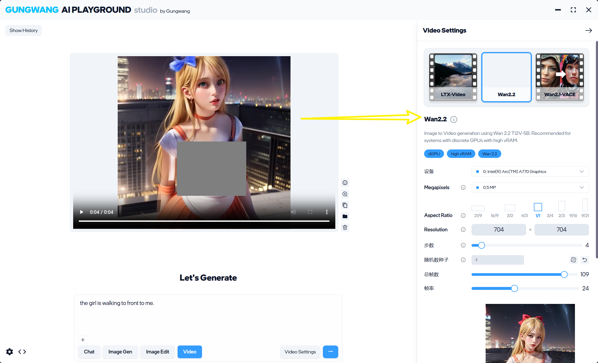
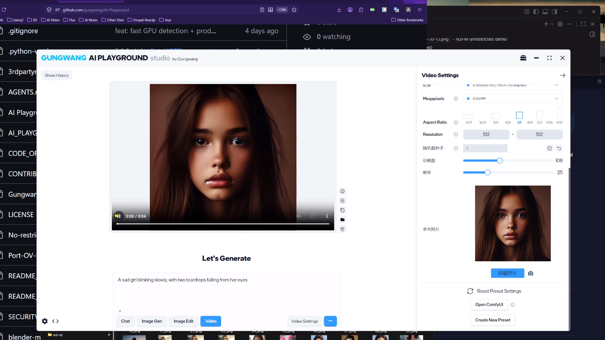

# Gungwang AI Playground improved from Intel AI Playground

Download Windows 11 installation file: 
https://github.com/gungwang/AI-Playground/releases/download/v3.2.4/Gungwang.AI.Playground-3.2.4.exe

- [readme.md](./readme.md)
- [README_GUNGWANG.md](./README_GUNGWANG.md)
- [README_GUNGWANG.zh.md](./README_GUNGWANG.zh.md)
- [readme.intel.md](./readme.intel.md)

## Integrated AI Playground Features

This fork includes the current AI Playground feature set from `main`, alongside its custom
Wan2.2, NSFW-disabled generation, and Intel Arc A770 configuration.

- **Latest chat models:** Gemma 4, Qwen3.5, Qwen3 VL, Mistral 7B, DeepSeek R1, and GPT-OSS
  are available through the supported Llama.cpp and OpenVINO backends.
- **Vision, reasoning, and RAG:** Chat supports image analysis, reasoning-capable models,
  document retrieval (RAG), tool calling, and custom system prompts. Use Qwen3 VL for vision,
  GPT-OSS 20B for reasoning and coding, and Mistral 7B Instruct for document RAG.
- **Image generation:** Generate images with Stable Diffusion 1.5, SDXL, Flux.1, and
  Z-Image models, from rapid drafts to high-quality results.
- **Image editing:** Use local, subscription-free upscaling, inpainting, outpainting,
  2D-to-3D conversion, and guided image editing.
- **Remote phone access:** Home Agent lets Telegram and Slack messages trigger AI Playground
  tasks on your home PC and receive the generated results remotely.

## 📸 Demo: No Restrictions

See the power of unrestricted generation:

*Generated without safety filters - full creative freedom*

=====================================

local site:
http://127.0.0.1:39100/

http://127.0.0.1:39100/v1/chat/completions
http://127.0.0.1:39100/v1/completions
http://127.0.0.1:39100/v1/models